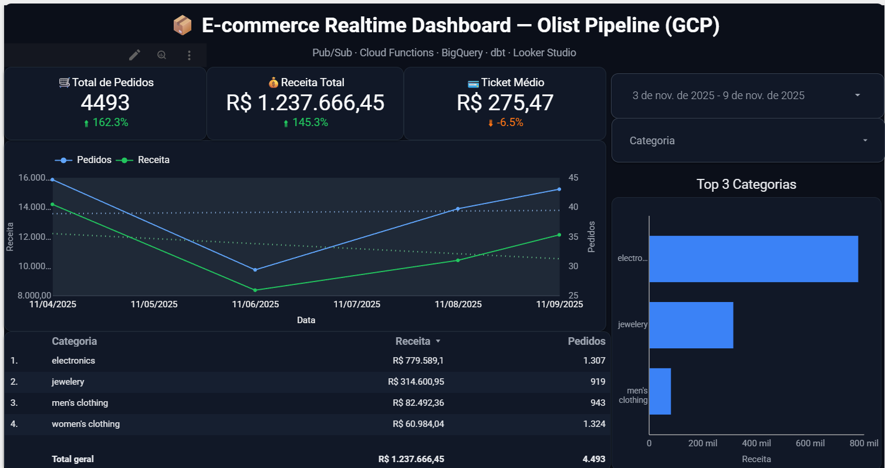

# 🛍️ E-commerce Realtime Pipeline — Olist (GCP)

**Resumo:**  
Pipeline de dados em tempo real que simula pedidos de e-commerce, processa com Pub/Sub e Cloud Functions, modela no BigQuery via dbt e exibe insights executivos no Looker Studio (tema escuro).

---

## ⚙️ Arquitetura

📄 [Ver documento técnico completo](docs/business_case.md)
🗺️ [Ver diagrama](docs/business_case.md)

## 🧩 Stack Técnica

| Camada         | Tecnologia                        |
| -------------- | --------------------------------- |
| Ingestão       | Python + Google Pub/Sub           |
| Processamento  | Cloud Functions (Python 3.11)     |
| Armazenamento  | BigQuery                          |
| Modelagem      | dbt                               |
| Visualização   | Looker Studio                     |
| Infraestrutura | Cloud Storage + Cloud Shell (GCP) |

## 📊 Dashboard (Looker Studio)

**🔗 Dashboard interativo:**
[Visualizar no Looker Studio](https://lookerstudio.google.com/reporting/7c1c0b13-2ba5-48c5-898e-d3542f463346)

**📄 Versão PDF armazenada no GCP:**
[Baixar Dashboard (Cloud Storage)](https://storage.googleapis.com/olist-realtime-pipeline-gcp-dashboards/olist_realtime_pipeline%20(1).pdf)

**📸 Preview**


### Principais KPIs:

* 🛒 Pedidos Totais
* 💰 Receita Total
* 💳 Ticket Médio
* 🏆 Top 3 Categorias
* ⏱️ Pedidos por Minuto (streaming realtime)

## 💡 Valor de Negócio

Permite monitorar em tempo real o desempenho de vendas, detectar ruptura de estoque e otimizar campanhas promocionais com base em dados atualizados minuto a minuto.

## 🧰 Execução Local (modo demo)

```python
# Gera 1000 pedidos simulados (2 eventos/segundo)
cd publisher
python app.py --eps 2 --max 1000

# Recria views no BigQuery
make views

# Verifica ingestão
make count && make tail
```

## 📦 Estrutura do Repositório

```
olist-realtime-pipeline-gcp/
├── publisher/              # Publicador de evento (simulação)
├── function/               # Cloud Function (transformação e ingestão)
├── dbt/                    # Modelos e transformações analíticas
├── dashboards/             # Dashboard PDF + prints + link
├── docs/                   # Business Case + Diagrama de Arquitetura
├── sql/                    # Views e queries BigQuery
├── Makefile                # Orquestração local
└── README.md

```

## 📈 Resultados

* ⚡ Ingestão e transformação em tempo real (Pub/Sub + Cloud Functions)
* 🧮 Modelagem escalável e versionada (dbt + BigQuery)
* 🎨 Visualização executiva no Looker Studio
* ☁️ Integração total com o ecossistema GCP
* 🧭 Base pronta para expansão em MLOps (churn e forecasting)

## 🚀 Próximos Passos

1. Criar modelo de previsão de churn e receita via Vertex AI.
2. Implementar monitoramento de qualidade de dados.
3. Criar alertas automáticos (Pub/Sub → Cloud Monitoring).
3. Publicar vídeo de portfólio (pipeline + dashboard).

## 👤 Autor

Olavo Defendi Dalberto
🎓 Engenharia da Computação — UFSM
📍 Santa Maria, RS
📧 [olavodalberto921@gmail.com](mailto:olavodalberto921@gmail.com)<br>
🔗 [LinkedIn](https://www.linkedin.com/in/olavo-defendi-dalberto/) | [GitHub](https://github.com/olavodd42)

## 📅 Licença

Este projeto é de uso educacional e demonstrativo, seguindo boas práticas de Engenharia de Dados com GCP.

*💬 “Transformar dados em decisão é o primeiro passo para transformar um negócio em crescimento.”*